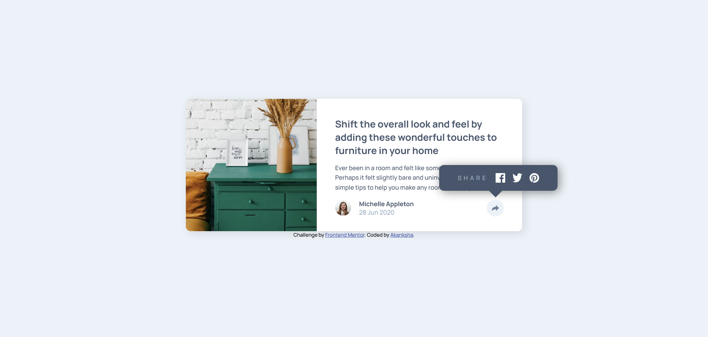
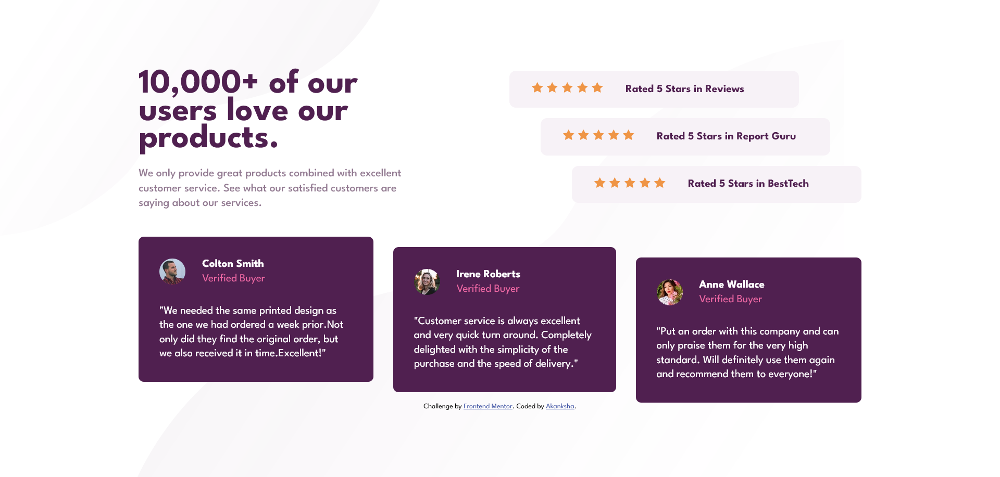
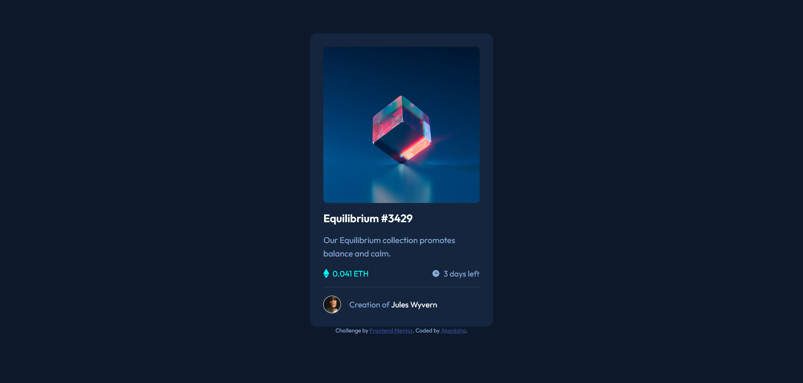
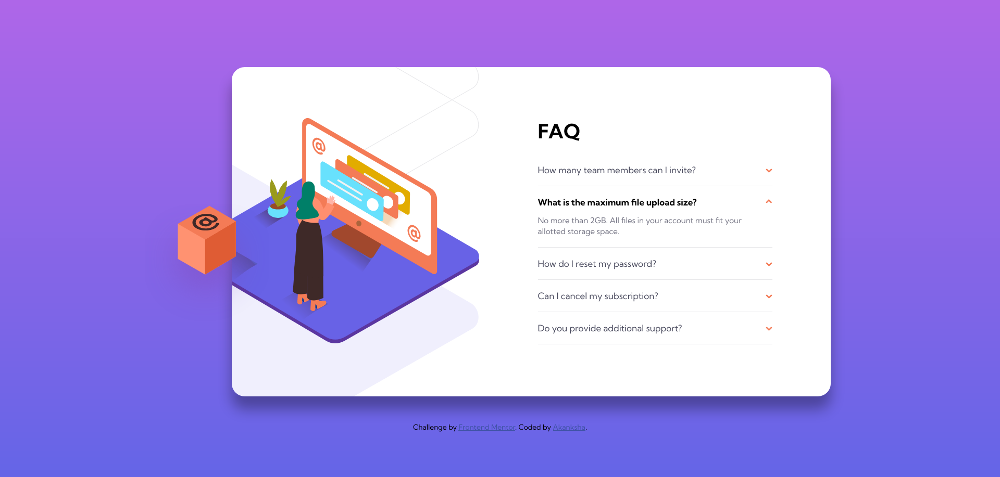
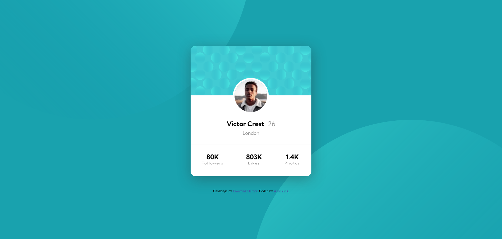
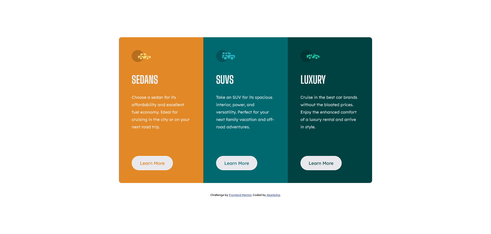
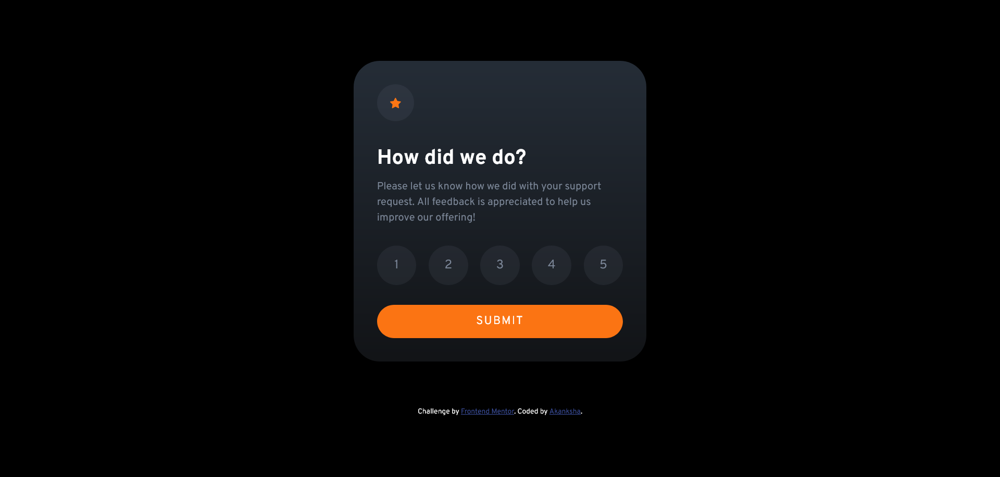
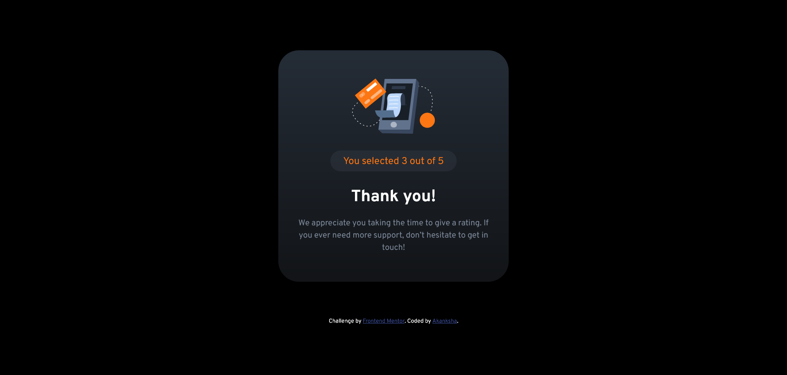
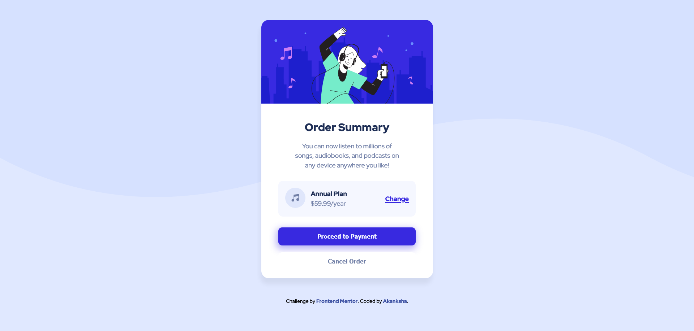
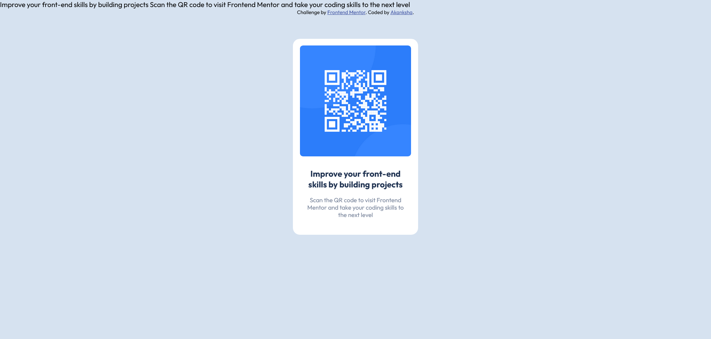

# FrontendMentor-challenges

These are the Solutions of frontend Challeges given in [FrontendMentor](https://www.frontendmentor.io/)

12. Article Preview component

- solution URL: [Solution](https://github.com/akanksha493/FrontendMentor-challenges/tree/main/article-preview-component-master)
- Live URl : [Live Preview](https://akanksha493.github.io/FrontendMentor-challenges/article-preview-component-master/)

 

11. Scocial Proof section

- solution URL: [Solution](https://github.com/akanksha493/FrontendMentor-challenges/tree/main/social-proof-section-master)
- Live URl : [Live Preview](https://akanksha493.github.io/FrontendMentor-challenges/social-proof-section-master/)

 

10. nft preview card component

- solution URL: [Solution](https://github.com/akanksha493/FrontendMentor-challenges/tree/main/nft-preview-card-component-main)
- Live URl : [Live Preview](https://akanksha493.github.io/FrontendMentor-challenges/nft-preview-card-component-main/)

 

9. FAQ Accordian card component

- solution URL: [Solution](https://github.com/akanksha493/FrontendMentor-challenges/tree/main/faq-accordion-card-main)
- Live URl : [Live Preview](https://akanksha493.github.io/FrontendMentor-challenges/faq-accordion-card-main/)

 

8. Profile card component

- solution URL: [Solution](https://github.com/akanksha493/FrontendMentor-challenges/tree/main/profile-card-component-main)
- Live URl : [Live Preview](https://akanksha493.github.io/FrontendMentor-challenges/profile-card-component-main/)

 

7. 3-Column Preview card component

- solution URL: [Solution](https://github.com/akanksha493/FrontendMentor-challenges/tree/main/3-column-preview-card-component-main)
- Live URl : [Live Preview](https://akanksha493.github.io/FrontendMentor-challenges/3-column-preview-card-component-main/)

 

6. Interactive rating component

- solution URL: [Solution](https://github.com/akanksha493/FrontendMentor-challenges/tree/main/interactive-rating-component-main)
- Live URl : [Live Preview](https://akanksha493.github.io/FrontendMentor-challenges/interactive-rating-component-main/)

 

5. Stats preview card component

- solution URL: [Solution](https://github.com/akanksha493/FrontendMentor-challenges/tree/main/stats-preview-card-component-main)
- Live URl : [Live Preview](https://akanksha493.github.io/FrontendMentor-challenges/stats-preview-card-component-main/)

 

4. Result Summary component

- solution URL: [Solution](https://github.com/akanksha493/FrontendMentor-challenges/tree/main/results-summary-component-main)
- Live URl : [Live Preview](https://akanksha493.github.io/FrontendMentor-challenges/results-summary-component-main/)

 

3. Order Summary component

- solution URL: [Solution](https://github.com/akanksha493/FrontendMentor-challenges/tree/main/order-summary-component-main)
- Live URl : [Live Preview](https://akanksha493.github.io/FrontendMentor-challenges/order-summary-component-main/)

 

2. Product preview card component

- solution URL: [Solution](https://github.com/akanksha493/FrontendMentor-challenges/tree/main/product-preview-card-component-main)
- Live URl : [Live Preview](https://akanksha493.github.io/FrontendMentor-challenges/product-preview-card-component-main/)

 

1. QR-code component

- solution URL: [Solution](https://github.com/akanksha493/FrontendMentor-challenges/tree/main/qr-code-component-main)
- Live URl : [Live Preview](https://akanksha493.github.io/FrontendMentor-challenges/qr-code-component-main/)

 

