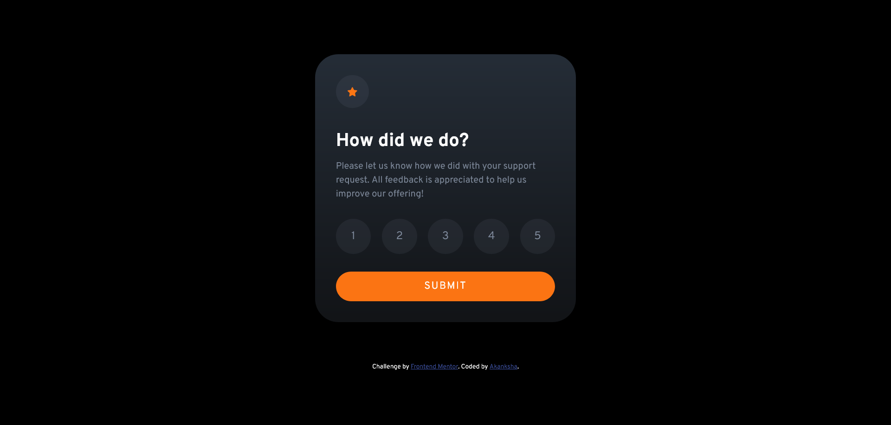

# Frontend Mentor - Interactive rating component solution

This is a solution to the [Interactive rating component challenge on Frontend Mentor](https://www.frontendmentor.io/challenges/interactive-rating-component-koxpeBUmI). Frontend Mentor challenges help you improve your coding skills by building realistic projects. 

## Table of contents

- [Overview](#overview)
  - [The challenge](#the-challenge)
  - [Screenshot](#screenshot)
  - [Links](#links)
- [My process](#my-process)
  - [Built with](#built-with)
  - [What I learned](#what-i-learned)
  - [Useful resources](#useful-resources)
- [Author](#author)

## Overview

### The challenge

Users should be able to:

- View the optimal layout for the app depending on their device's screen size
- See hover states for all interactive elements on the page
- Select and submit a number rating
- See the "Thank you" card state after submitting a rating

### Screenshot

### Links

- Solution URL: [Source Code]()
- Live Site URL: [Live Preview]()

## My process

### Built with

- Semantic HTML5 markup
- CSS custom properties
- Flexbox
- CSS Grid
- javascript

### What I learned
- how to work with nodelist
- how to toggle to hide or show some component
- resposive layout design

### Useful resources

- [tutorialspoint](https://www.tutorialspoint.com/How-to-hide-HTML-element-with-JavaScript), [stackoverflow](https://stackoverflow.com/questions/6242976/javascript-hide-show-element): how to hide or show html components using javascript.
- [How to make a star rating with JS](https://dev.to/leonardoschmittk/how-to-make-a-star-rating-with-js-36d3), [stackoverflow](https://stackoverflow.com/questions/70125098/get-only-the-first-6-elements-from-queryselectorall): helped me in building interative rating component.
- [article on margin collapse](https://www.joshwcomeau.com/css/rules-of-margin-collapse/): for resposive layout.

## Author

- Frontend Mentor - [Akanksha](https://www.frontendmentor.io/profile/akanksha493)
