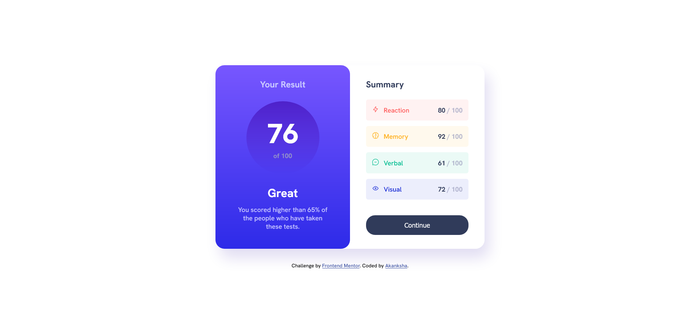

# Frontend Mentor - Results summary component solution

This is a solution to the [Results summary component challenge on Frontend Mentor](https://www.frontendmentor.io/challenges/results-summary-component-CE_K6s0maV). Frontend Mentor challenges help you improve your coding skills by building realistic projects. 

## Table of contents

- [Overview](#overview)
  - [The challenge](#the-challenge)
  - [Screenshot](#screenshot)
  - [Links](#links)
- [My process](#my-process)
  - [Built with](#built-with)
  - [What I learned](#what-i-learned)
  - [Continued development](#continued-development)
  - [Useful resources](#useful-resources)
- [Author](#author)

## Overview

### The challenge

Users should be able to:

- View the optimal layout for the interface depending on their device's screen size
- See hover and focus states for all interactive elements on the page
- **Bonus**: Use the local JSON data to dynamically populate the content

### Screenshot



### Links

- Solution URL: [Source Code](https://your-solution-url.com)
- Live Site URL: [Live Site](https://your-live-site-url.com)

## My process

### Built with

- Semantic HTML5 markup
- CSS custom properties
- Flexbox

### What I learned

In this project I've used CSS variable which helped me writing code pretty fast, I've also used rem font sizes, which further reduce the media-queries that I would have to write instead. 

Some new css properties that I've learned while building this project are:

>Below code lets you set the actual width, any padding you set will be deduted from that width instead of adding to the container width.
```css
.summary-card{
    box-sizing: border-box;
}
```

>And, the below code lets you set height same as width without explicitly setting height
```css
.score-container{
    width: 20px;
    aspect-ratio: 1/1;
}
```

### Continued development

Building this project made me realise I do struggle with responsiveness, and a bit with flexbox, So in future i would like to refine those.

### Useful resources

Below are some of the articles that helped me build this project:

- [box-sizing  css property](https://www.w3schools.com/css/css3_box-sizing.asp) - This helped me build container without overflowing content to its original container. 
- [height same as dynamic width](https://stackoverflow.com/questions/5445491/height-equal-to-dynamic-width-css-fluid-layout) - This is an amazing article on the topic, it also gives you lot of options to try.

## Author

- Frontend Mentor - [@akanksha493](https://www.frontendmentor.io/profile/akanksha493)


