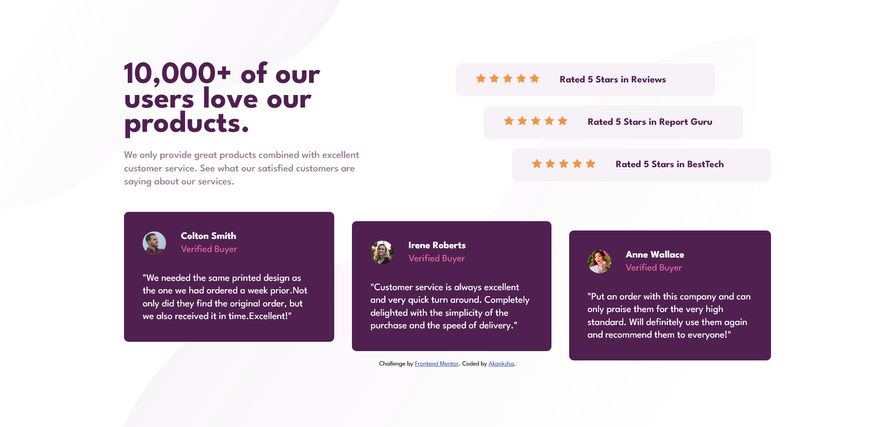

# Frontend Mentor - Social proof section solution

This is a solution to the [Social proof section challenge on Frontend Mentor](https://www.frontendmentor.io/challenges/social-proof-section-6e0qTv_bA). Frontend Mentor challenges help you improve your coding skills by building realistic projects. 

## Table of contents

- [Overview](#overview)
  - [The challenge](#the-challenge)
  - [Screenshot](#screenshot)
  - [Links](#links)
- [My process](#my-process)
  - [Built with](#built-with)
  - [Useful resources](#useful-resources)
- [Author](#author)

## Overview

### The challenge

Users should be able to:

- View the optimal layout for the section depending on their device's screen size

### Screenshot

### Links

- Solution URL: [Live Preview](https://akanksha493.github.io/FrontendMentor-challenges/social-proof-section-master/)

## My process

### Built with

- Semantic HTML5 markup
- CSS custom properties
- Flexbox
- CSS Grid
- Mobile-first workflow

### Useful resources

Some of the online resources I used:
1. [Setting specific space between flex items- the gap property](https://stackoverflow.com/questions/20626685/how-do-i-set-distance-between-flexbox-items) 
2. [nth child selector](https://css-tricks.com/almanac/selectors/n/nth-child/) 

## Author

- Frontend Mentor - [Akanksha](https://www.frontendmentor.io/profile/akanksha493)
